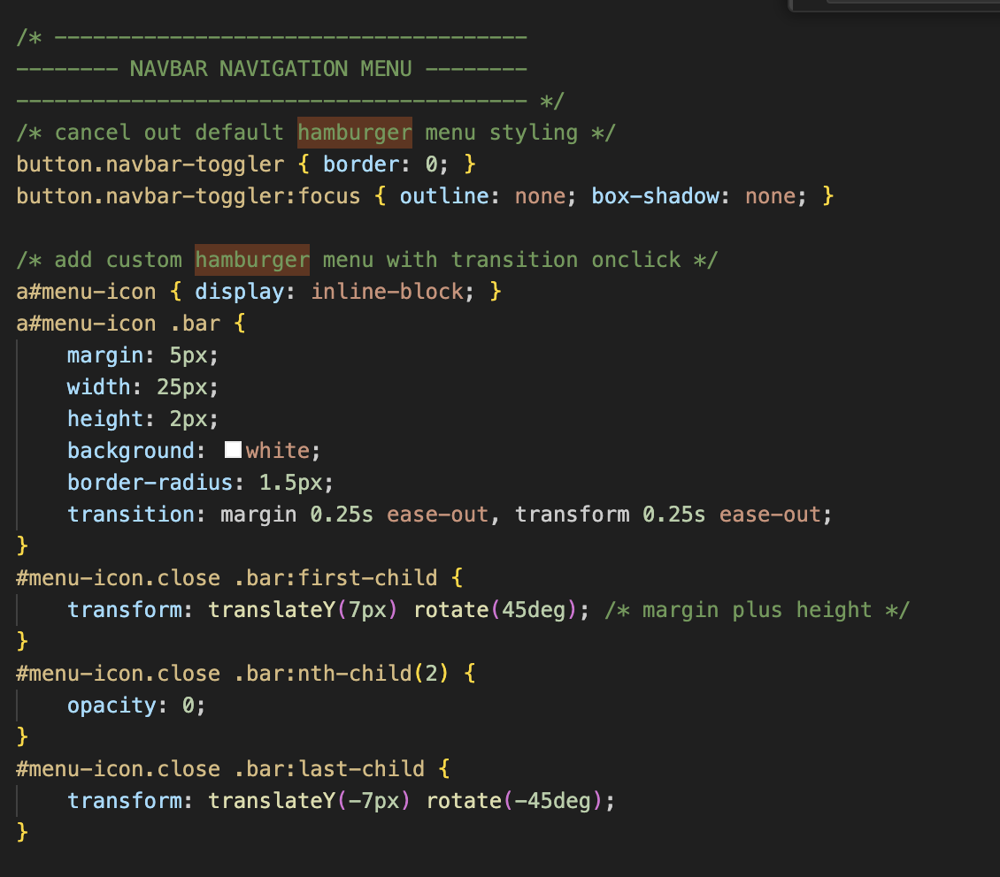
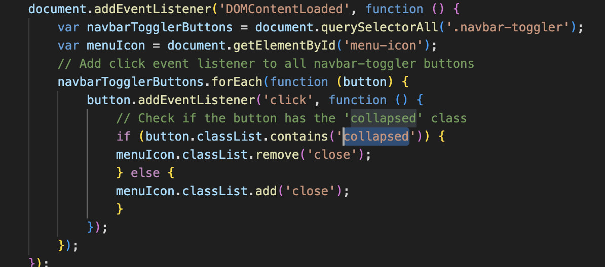
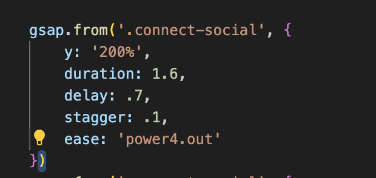

# FINAL PROJECT

GITHUB PAGES LINK TO WEBSITE https://audre70.github.io/Portfolio/index.html

My project was a continuation / redo of my personal website. This time around, I aimed for a more clean, modern style and polished look, while also mastering the things we've learned in the class about Javascript, Bootstrap, and GSAP. I wanted it to be fully responsive all the way from super giant HD screens to skinny small mobile screens.

I've been working on this for a couple weeks and encountered a few difficulties along the way because I was really set on making some things work, such as a flipping nav link animation, the toggle hamburger to X animation, and also the keyframe photo 'carousel' (not really a carousel but I'm not sure what to call it).

### Some code snippets

### Issues I encountered
- When I was trying to animate the hamburger menu into an "x" when the dropdown was toggled open on mobile (indicating that the menu could now be closed), I was trying to use bootstrap's event listeners to detect when the menu was open. I had a hard time inspecting it at first because my hamburger would only animate to an X after the menu was fully open, not during the 'opening' animation of the menu which made the icon seem like it wasn't giving proper feedback.
- theres also a problem with the hamburger menu I can't figure out -- when it opens, the animation is not smooth / it's choppy.
- for GSAP, I found that using a lot of scrolltrigger functions would slow down the processing of my website, so I reduced how many I used
- For my photocarousel, it would be choppy and not animate properly, but luckily I found a tutorial that was doing the exact thing I was trying to do.
- I spent a day trying to get one of my p5.js sketches into the background of one of my webpages, which worked but made the website really slow. The sketch was basically a fun interactive animation that followed your cursor, so I'm not sure why it made my site crash. In the end, I left it out. In the future, I want to learn how to better optimize the website when I import external libraries or use javascript.
- I'm not sure why, but the hover animation on my featured project thumbnails on my homepage are not animating properly on safari. It works fine on Firefox and Chrome, but the border radius of the thumbnail glitch out on Safari.

### Things I learned
- I think this process has made me really become super familiar with bootstrap and I know what I find it useful for, such as plugging in classes to hide/show stuff at different breakpoints without having to write additional CSS, plugging in classes to do flex positioning, container wrappers, etc.
- I'm comfortable importing external libraries and using them on my website.
- I'm confident I can design scalable things responsively for different screens.

### What I would do next:
- We spent a class briefly on SASS. If I had more time I would love to create my own framework instead of using bootstrap's, because it was frustrating to use and more difficult to override than it was helpful. I didn't really realize this until I started trying to rebuild my site in Bootstrap.
- In general, I'm not sure that my code is the cleanest and most efficient it could be. I wondered a lot of the time when I was building this site if there was a better way for me to build something, but I hope to get some feedback about that.
- however, overall, this was an amazing learning experience and I'm so glad I know how to build most things for websites.

### References:
- Hamburger dropdown animation https://ryfarlane.com/article/animated-hamburger-menu-icon-to-x-close-icon-css
- https://www.youtube.com/watch?v=nAjR0Oj0J8E&t=626s
- https://www.youtube.com/watch?v=m6PDUIF24v4&list=WL&index=138&t=662s
- https://gsap.com/docs/v3/Plugins/ScrollTrigger/
- https://www.thecodecreative.com/blog/gsap-scrolltrigger-toggle-actions
- https://getbootstrap.com/docs/5.3/layout/breakpoints/
- https://getbootstrap.com/docs/5.3/components/modal/
- ... and a lot more bootstrap references

### Design Inspiration:
https://www.slope.agency/
https://www.apple.com/