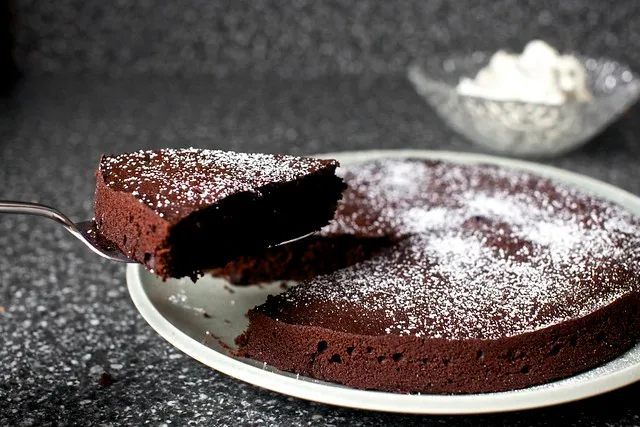

# Red Wine Chocolate Cake
Source: https://smittenkitchen.com/2011/09/red-wine-chocolate-cake/

This is my favorite chocolate cake recipe, sourced from Smitten Kitchen. I make it every holiday season, and *everyone* raves about it. It's decadent and chocolatey but fluffy, and the red wine notes makes it taste extra fancy. It pairs perfectly with a buttery mascarpone cream topping, which is my favorite part. It's a showstopping dish that's super simple and impressive!

## Ingredients
**Cake**
- 6 tablespoons unsalted butter, at room temperature
- 3/4 cup firmly packed dark brown sugar
- 1/4 cup white granulated sugar
- 1 large egg + 1 large egg yolk, at room temperature
- 3/4 cup red wine, any kind you like*
- 1 teaspoon vanilla extract
- 1 cup + 1 tablespoon all-purpose flour
- 1/2 cup Dutch cocoa powder
- 1/8 teaspoon baking soda
- 1/2 teaspoon baking powder
- 1/4 teaspoon table salt
- 1/4 teaspoon ground cinnamon

**Mascarpone topping**
- 1/2 cup mascarpone cheese
- 1/2 cup chilled heavy or whipping cream
- 2 tablespoons granulated sugar
- 1/4 teaspoon vanilla extract

## Directions
### Make the cake.
1. Preheat the oven to 325°F. Line the bottom of a 9-inch round cake pan with parchment.
2. In a large bowl, on the medium speed of an electric mixer, cream the butter until smooth. Add the sugars and beat until fluffy, about 3 minutes. 
3. Add the egg and yolk and beat well, then the red wine and vanilla.
4. Sift the flour, cocoa, baking soda, baking powder, cinnamon and salt together, right over your wet ingredients. Mix until 3/4 combined, then fold the rest together with a rubber spatula. 
5. Spread batter in prepared pan. Bake for 25 to 30 minutes, or until a cake tester inserted into the center comes out clean. The top of the cake should be shiny and smooth, like a puddle of chocolate. 
6. Cool in pan on a rack for about 10 minutes, then flip out of pan and cool the rest of the way on a cooling rack. This cake keeps well at room temperature or in the fridge. It looks pretty dusted with powdered sugar.
### Make the topping.
1. Whip mascarpone, cream, sugar and vanilla together until soft peaks form — don’t overwhip. Dollop generously on each slice of cake. It can also be covered and refrigerated for up to 4 hours.