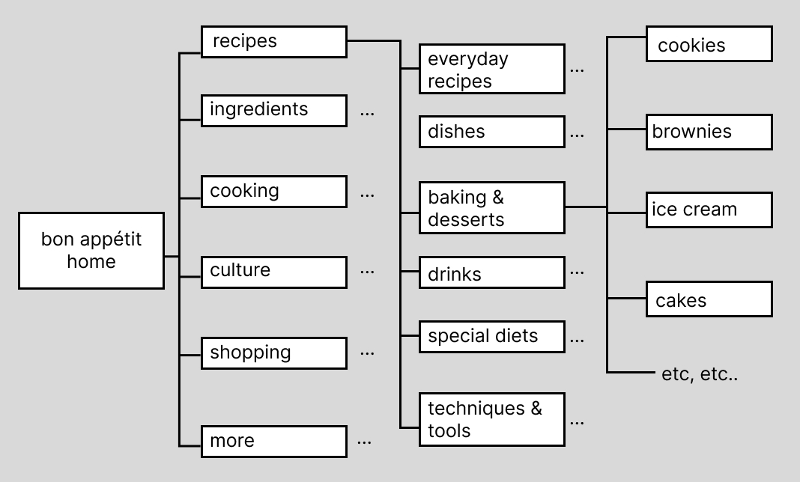
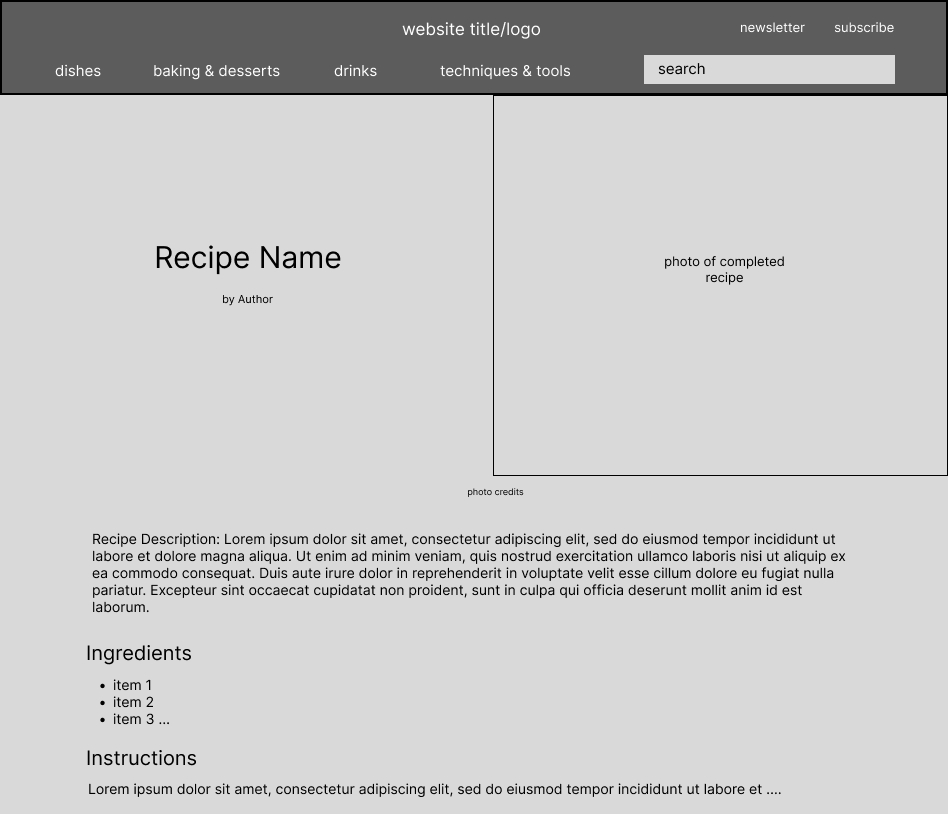
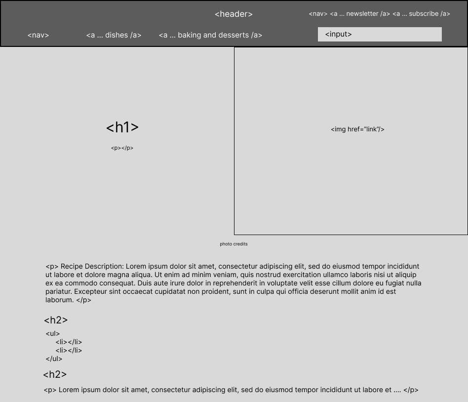

# HOMEWORK WEEK 2 - Due Monday, Week 3

### Analysis/diagram of site map and Information Architecture

### Read [article](https://origin-blog.mediatemple.net/web-development-tech/five-important-considerations-for-wireframing/) on wireframing, post reaction.

see [link to my reaction](Homework/reaction_article_wireframe.md)

### Wireframe layout for recipe.
Think - rows, columns, sidebars, headers, footers etc. Be sure to mark up each block of content in your wireframe with a few HTML tags for practice.

*Wireframe without HTML tags*

*Wireframe with HTML tags*

### Mark up your recipe in HTML semantically based on your wireframe.
Bonus points for applying some basic font and color styles.

see [link to my recipe](Homework/recipe_final.html)