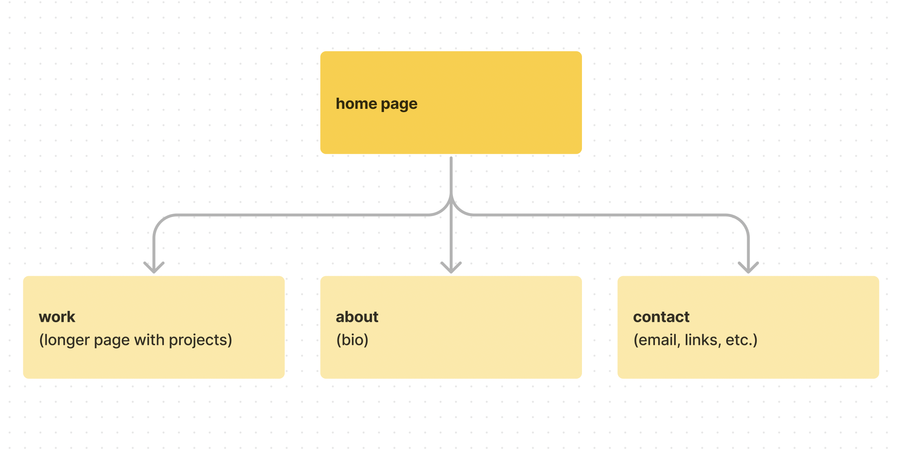
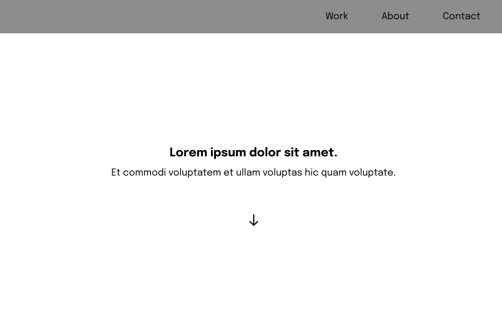
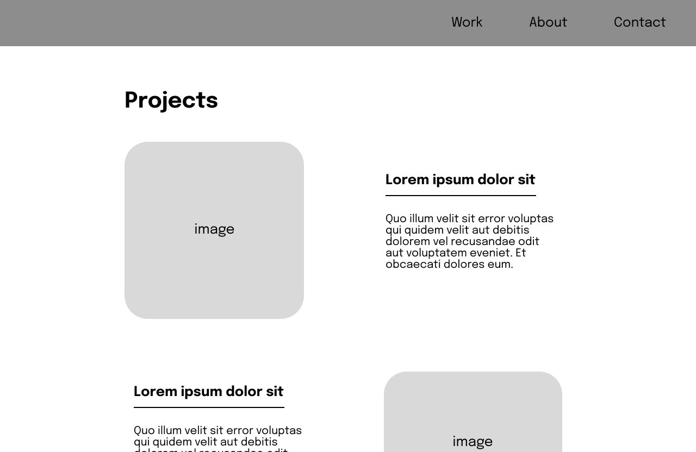
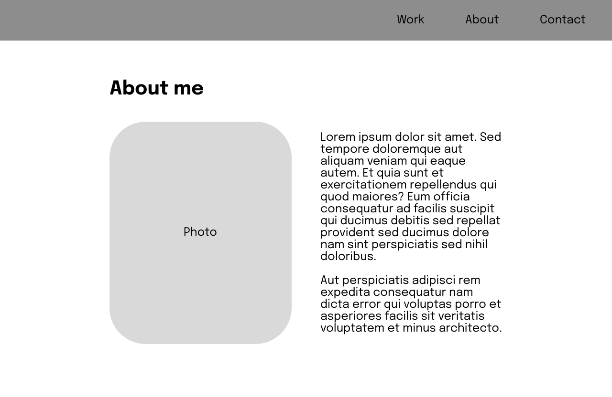

# Midterm Proposal (Homework Week 4), due Monday Week 5: 

### Concept/Theme
My goal is to create a professional website for showing my projects/art/etc like a portfolio. The main page will be fairly straightforward with a one sentence and with an image background, and you can scroll down to preview works. There will be a nav bar to lead to further reading about projects, a bio section, and contact information.

### Site Map

### Wireframes
**Home Page**

**Works**

**About**

### Inspiration
link to pinterest.

### Concepts/Skills to Use
What we have covered: nav bar, floats/flex box, links, interactive hovering, inserting images, importing fonts.
What we haven't covered: icons (arrows), larger link clicking area, download links.

-- 

at least 3 page website
5 mins tops presentation (recommend slideshow, link needed if so)
site map and wireframes, can use figma. shouldn't be complicated.
existing website you used inspiration from (bonus pts for mood board or pinterest colleciton)
concepts/skills we have learned that you'll use to build your site
concepts/skills you still need to learn

don't go crazy, just a 2 week project. only focus on html and css

figma -- switch button at top to go to developer side (instead of designer side).

resources -- paletton (color picker)